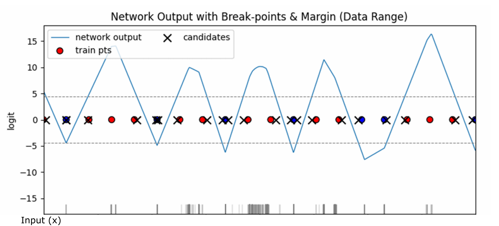
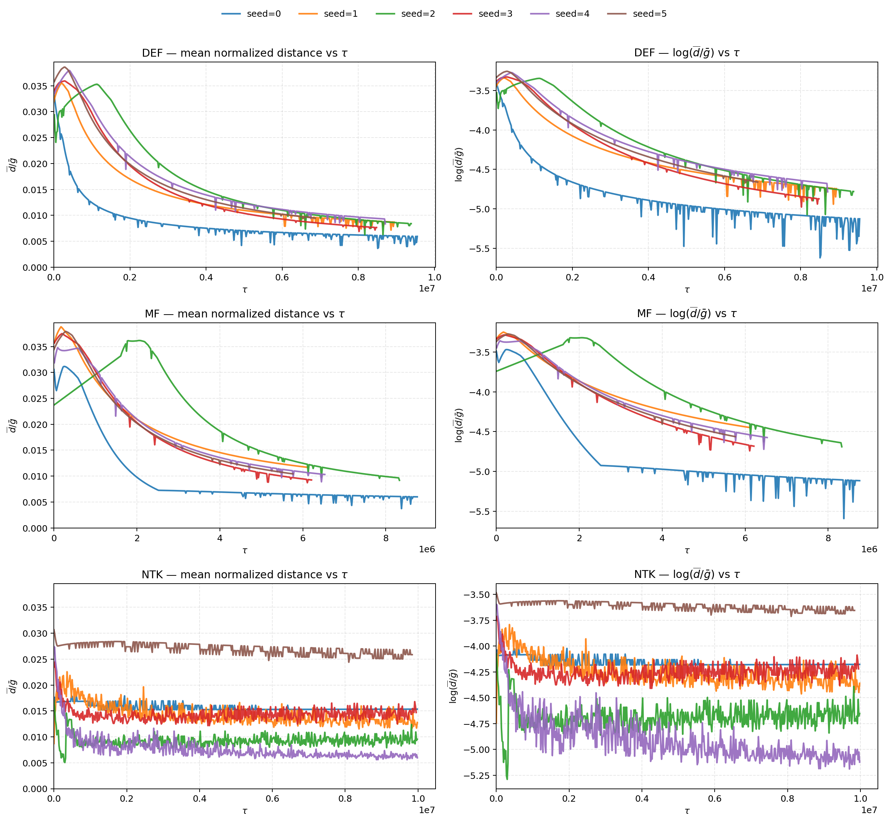
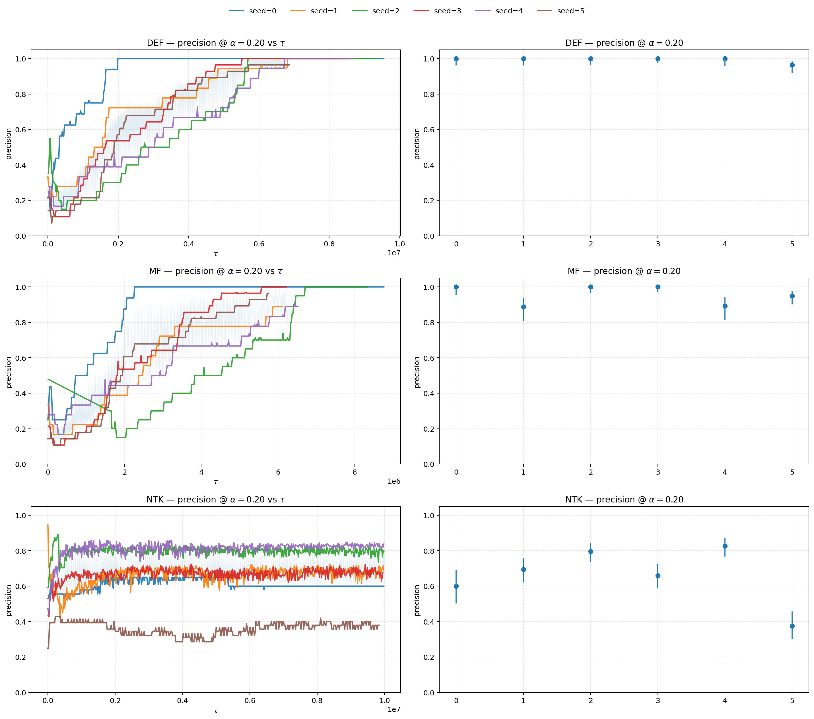
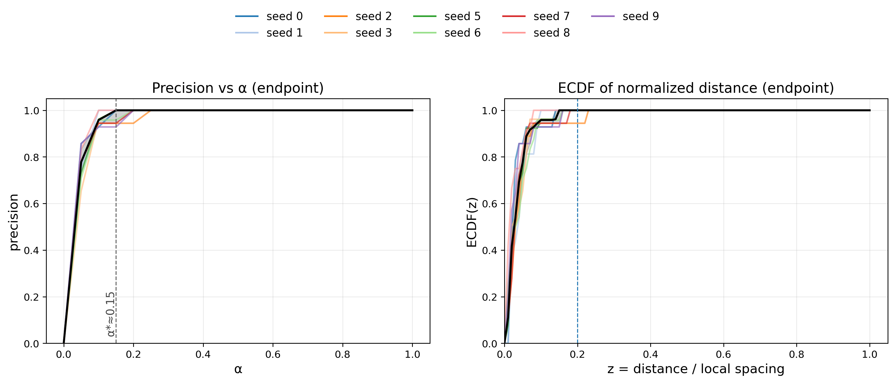
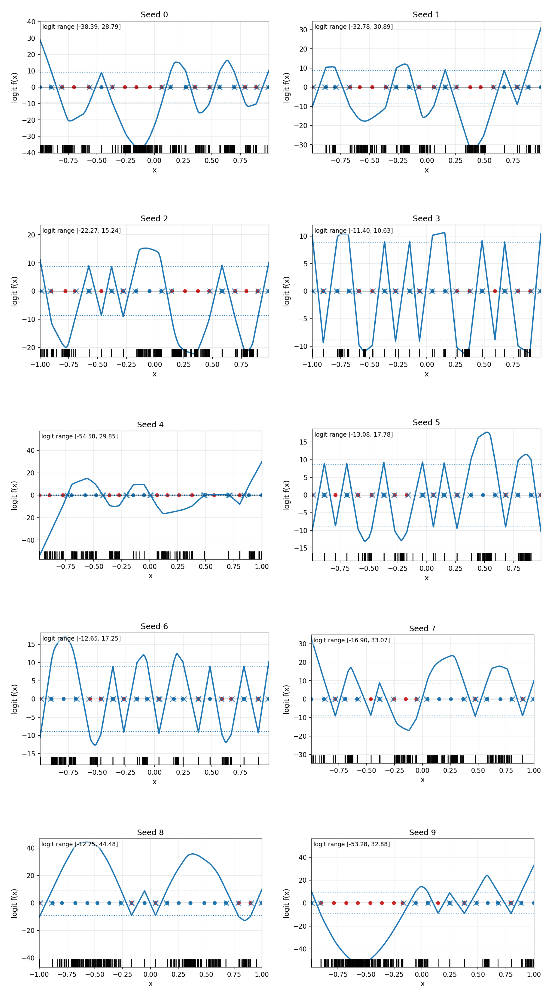

# White-Box Data Reconstruction in Trained ReLU Networks

**MSc Data Analytics Dissertation – University of Warwick**

This repository contains the experimental code, results, and supporting theory for my MSc dissertation investigating **white-box data reconstruction attacks in trained neural networks**.

The project explores a fundamental question in machine learning privacy:

> **Can the parameters of a trained neural network leak information about the data it was trained on?**

Using controlled 1-D binary classification tasks and ReLU networks, I studied how the geometry learned during training can be exploited to reconstruct training support points directly from model parameters.

---

## Training Dynamics

The animation below shows the evolution of a trained ReLU network and the candidate reconstruction points extracted from its learned geometry.

[https://github.com/abdullah12353/<repo-name>/blob/main/training_dynamics.mp4](https://github.com/abdullah12353/MSc-DISS-privacy-attacks-relu-networks/blob/main/training_dynamics.mp4)

As training progresses beyond 100% classification accuracy, candidate points continue moving toward the true support points of the training set.

---

## Project Overview

The project builds on recent theoretical work showing that a finite candidate set can be recovered from trained 2-layer ReLU networks.

Rather than relying on dense grid searches, I implemented a **piecewise-affine analytic reconstruction algorithm** that:

1. Extracts network breakpoints directly from model parameters.
2. Partitions the input domain into affine regions.
3. Analytically solves for margin-crossing points.
4. Produces a finite candidate reconstruction set.
5. Evaluates reconstruction quality throughout training.

The experiments were implemented in **PyTorch** and executed at scale on the **University of Warwick HPC cluster** using Slurm job arrays.

---

# Key Result 1: Candidate Reconstruction from Network Geometry



The learned ReLU network is piecewise-linear between breakpoints.

This allows candidate reconstruction points (black crosses) to be recovered analytically rather than via brute-force search. Even in early experiments, the extracted candidates visibly align with the original training points.

---

# Key Result 2: Post-Convergence Geometric Alignment



A central finding of the dissertation was that reconstruction quality continues improving **after** the network reaches 100% training accuracy.

The figure above tracks the normalised distance between reconstructed candidates and true support points as a function of post-convergence training time.

The approximately linear behaviour on the log-scale plot suggests exponential convergence toward support points.

---

# Key Result 3: Feature Learning vs Lazy Training



A major question was whether reconstruction emerges simply from overparameterisation or from genuine feature learning.

Experiments compared:

* Default training
* Mean-field (feature-learning) regimes
* NTK/lazy-training regimes

Feature-learning regimes achieved near-perfect endpoint precision, whereas reconstruction performance degraded substantially in the lazy regime.

This suggests the vulnerability is tied to learned feature geometry rather than network size alone.

---

# Key Result 4: Robustness Across Distance Thresholds



To avoid relying on a single reconstruction threshold, I evaluated performance across a wide range of tolerances.

The precision curves and empirical cumulative distribution functions demonstrate that reconstructed candidates remain tightly concentrated around the true support points.

---

# Key Result 5: Qualitative Multi-Seed Audit



The final reconstruction behaviour was inspected across multiple random seeds.

Each panel shows:

* learned network geometry
* training points
* breakpoints
* reconstructed candidate points

The consistency across seeds provides strong qualitative evidence that the observed behaviour is not an artefact of a single training run.

---

# Novel Contribution: Extension to 3-Layer Networks

The original reconstruction procedure was developed for shallow 2-layer ReLU networks.

As part of this dissertation, I designed and implemented a prototype extension for **3-layer ReLU architectures**, adapting the margin-crossing methodology to the more complex activation geometry created by deeper networks.

Experiments demonstrated successful reconstruction behaviour in controlled settings, suggesting that the vulnerability extends beyond the shallow-network regime.

---

# Mathematical Analysis

The repository also includes supporting theoretical work:

📄 **proofs.pdf**

The note explores conditions under which false positives can be eliminated and investigates connections between:

* Margin geometry
* Total variation minimisation
* Implicit bias of gradient descent
* Piecewise-linear ReLU representations

---

# Technologies Used

* Python
* PyTorch
* NumPy
* Pandas
* Matplotlib
* Slurm
* Linux HPC environments

---

# Repository Structure

```text
src/            Core training and reconstruction pipeline
slurm/          HPC job scripts
3.1.png         Candidate reconstruction example
5.1.png         Distance convergence results
5.2.png         Precision and endpoint reliability
5.9.png         Robustness analysis
5.12.png        Multi-seed qualitative audit
training_dynamics.mp4
proofs.pdf
```

---

# Main Takeaway

Theoretical work previously guaranteed only a constant-fraction reconstruction of training supports.

Across controlled experiments, the empirical behaviour was substantially stronger:

* Feature-learning regimes achieved near-perfect reconstruction.
* Candidate locations converged toward true support points after training accuracy saturated.
* Lazy/NTK training acted as a useful negative control.
* Similar reconstruction behaviour was observed in deeper architectures.

These results suggest that the privacy leakage encoded within trained neural networks may be significantly stronger than current theoretical guarantees imply.
